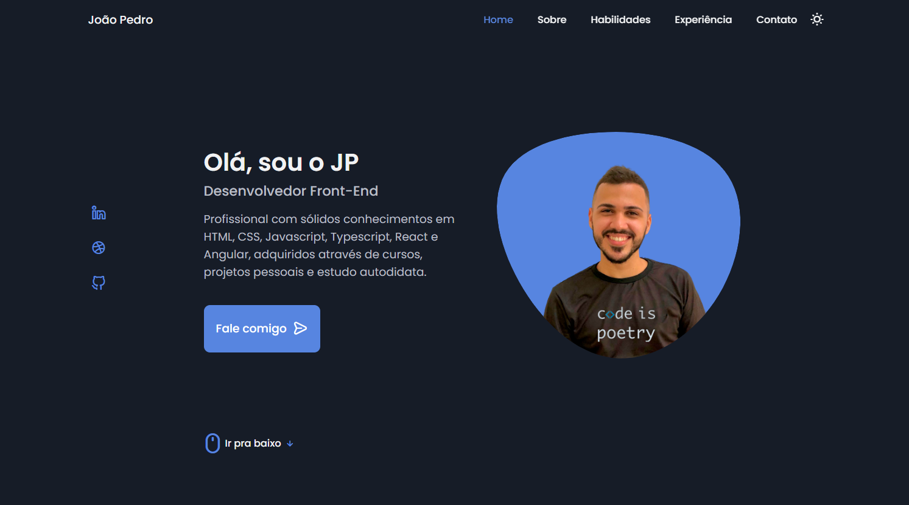
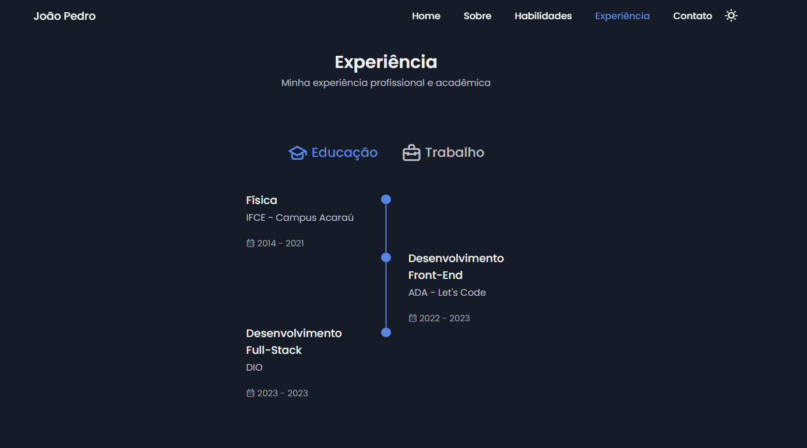
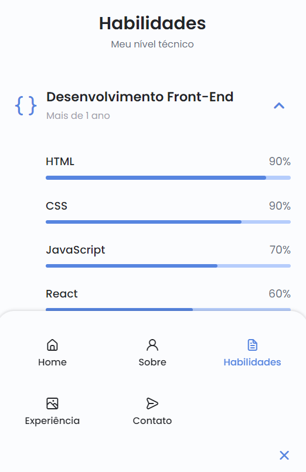

# Meu Site Pessoal

Bem-vindo ao repositório do meu site pessoal! Este site foi desenvolvido para apresentar minha identidade como desenvolvedor front-end, minhas habilidades, formação e muito mais. 💻

## Visão Geral

Este projeto é um site pessoal que serve como meu portfólio online. Ele inclui as seguintes seções:

- **Página Inicial:** Uma breve introdução sobre mim.
- **Habilidades:** Lista das habilidades que possuo como desenvolvedor front-end.
- **Formação:** Detalhes sobre minha educação e cursos relevantes.
- **Projetos:** Destaque de projetos significativos que concluí.
- **Contato:** Informações para entrar em contato comigo.

## Tecnologias Utilizadas

- HTML
- CSS
- JavaScript

## Capturas de Tela

 

 

 

    
     
    
     

## Como Visualizar

Se você deseja visualizar o site, pode fazê-lo acessando [https://seusite.com](https://seusite.com).

## Como Contribuir

Este é um projeto pessoal, mas se você tiver sugestões ou encontrar problemas, fique à vontade para abrir uma issue ou enviar um pull request.

## Autor

- João Pedro

_Conecte-se comigo no Linkedin:_
[https://www.linkedin.com/in/joaopedronascimento/]
